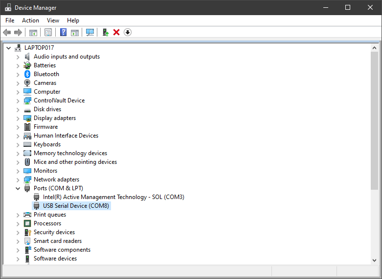

On Windows:

1. Install a program to talk serial, like [putty](https://www.chiark.greenend.org.uk/~sgtatham/putty/latest.html)

2. Find the COM port that pops up when you plug in the usb cable in device manager

3. Set up that COM port with speed 115200

4. Push some buttons, see what happens (also try CTRL+C and CTRL+D)

