# Riscufefe \#5 badge repo

Some howto’s below.

# The GLITCHIFIER9000 in a nutshell

<figure>

<figcaption aria-hidden="true">Figure 1: What is voltage
glitching?</figcaption>
</figure>

<figure>
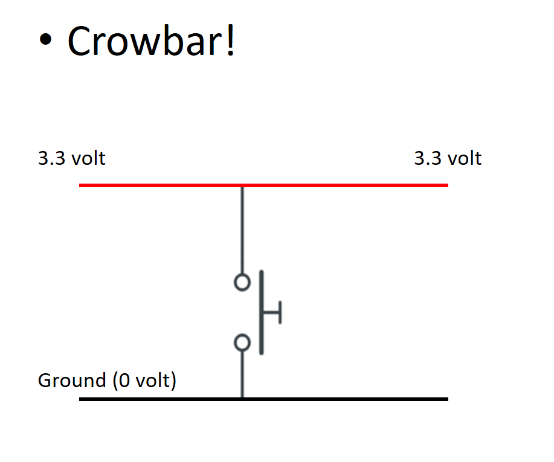
<figcaption aria-hidden="true">Figure 2: Normal operation</figcaption>
</figure>

<figure>
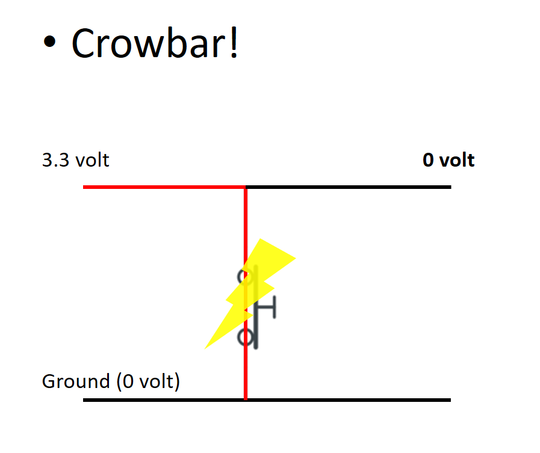
<figcaption aria-hidden="true">Figure 3: While glitching</figcaption>
</figure>

Check out the schematics [in this
repo](https://github.com/inconspicuous-username/Glitchifier9000/blob/main/hardware/pdf/Glitchifier9000-sch.pdf)
for more information!

NOTE: The trigger input is currently set to the button for demo
purposes, the use a different pin you have to modify [this
line](https://github.com/inconspicuous-username/Glitchifier9000/blob/main/firmware/upython/badge/glitchifier9000.py#L32).

# Hardware DIY instructions

## Minimal badge functionality

To get minimal badge functionality:

1.  Solder C3, C4

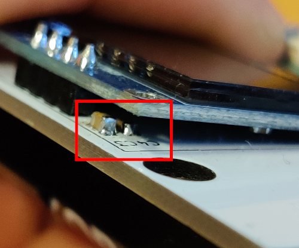

2.  To protect your PICO from having battery and USB power at the same
    time, solder Q1:

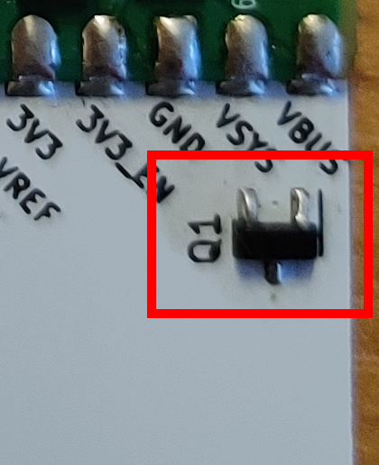

3.  To be able to switch off the batteries, solder SW1:

<table>
<colgroup>
<col style="width: 50%" />
<col style="width: 50%" />
</colgroup>
<tbody>
<tr class="odd">
<td style="text-align: center;">

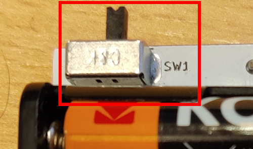

</td>
<td style="text-align: center;">

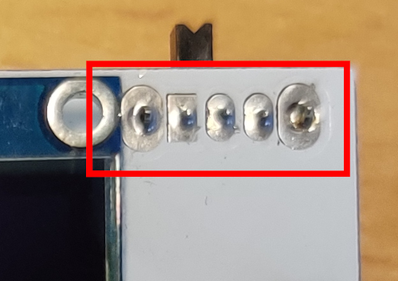

</td>
</tr>
</tbody>
</table>

4.  Attach the screen to the front:

<table>
<colgroup>
<col style="width: 50%" />
<col style="width: 50%" />
</colgroup>
<tbody>
<tr class="odd">
<td style="text-align: center;">

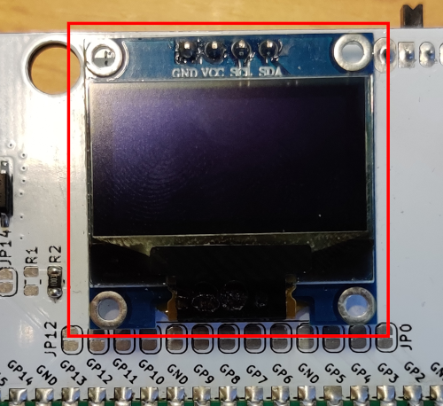

</td>
<td style="text-align: center;">

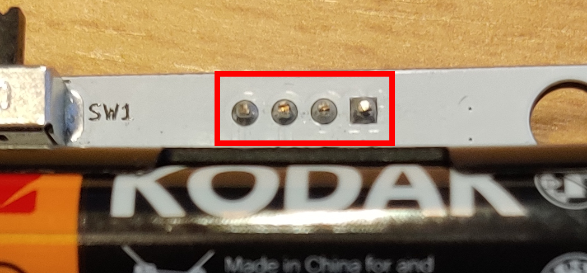

</td>
</tr>
</tbody>
</table>

5.  Attach the AAA battery holder to the back:

<table>
<colgroup>
<col style="width: 50%" />
<col style="width: 50%" />
</colgroup>
<tbody>
<tr class="odd">
<td style="text-align: center;">

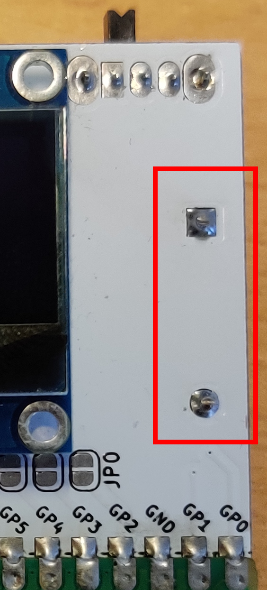

</td>
<td style="text-align: center;">

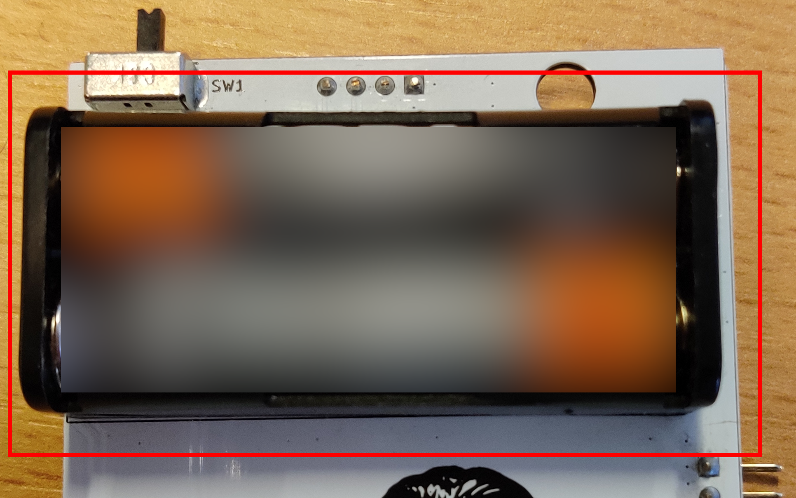

</td>
</tr>
</tbody>
</table>

6.  Insert 2xAAA batteries:

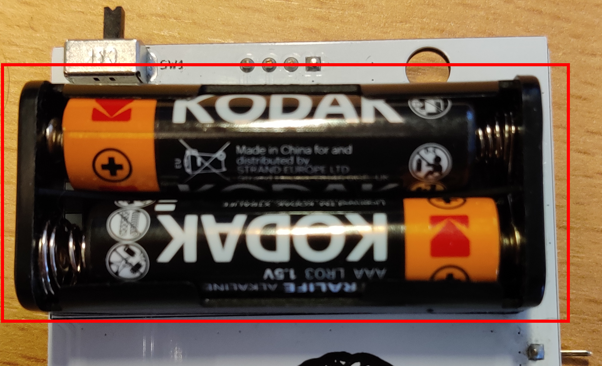

You should now be able to see stuff on the screen, and you can interact
over USB / serial.

## Button controls

To control the badge with the button:

1.  Solder the 10 (3, 2, 3, 2) points of the button at SW1:

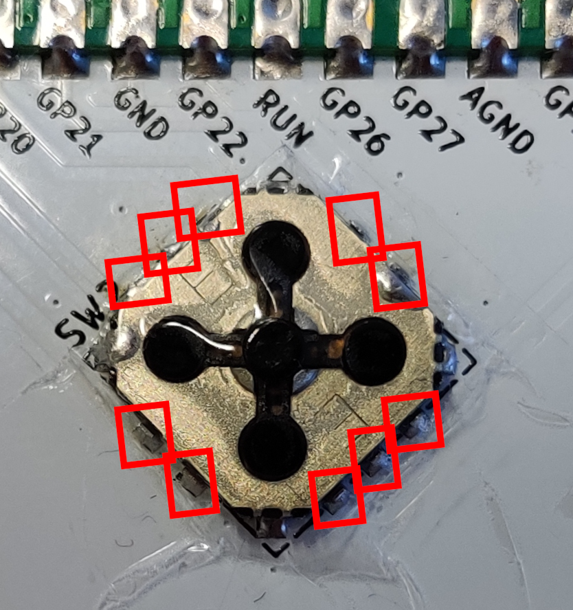

You should now be able to use the botton.

## GLITCHIFIER9000

To add GLITCHIFIER9000 functionality:

1.  Solder R2

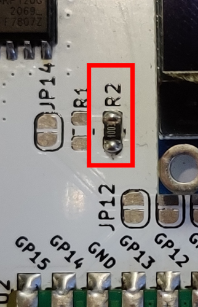

2.  Solder unlabeled SOT8 MOSFET:

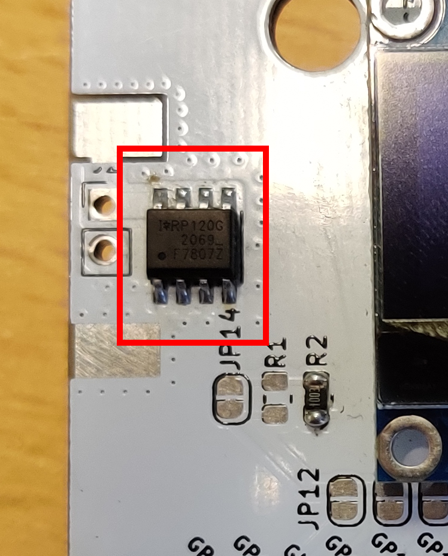

Ready to glitch!

# Talk to the badge over USB

1.  Plug in micro-usb cable.

Ready to talk!

## On Windows

1.  Install a program to talk serial, like
    [putty](https://www.chiark.greenend.org.uk/~sgtatham/putty/latest.html)

2.  Find the COM port that pops up when you plug in the USB cable in
    device manager

3.  Set up that COM port with speed 115200

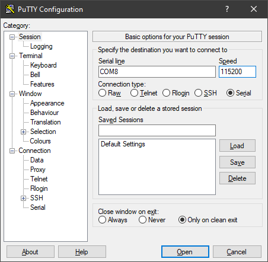

4.  Type some buttons, see what happens (also try CTRL+C and CTRL+D)

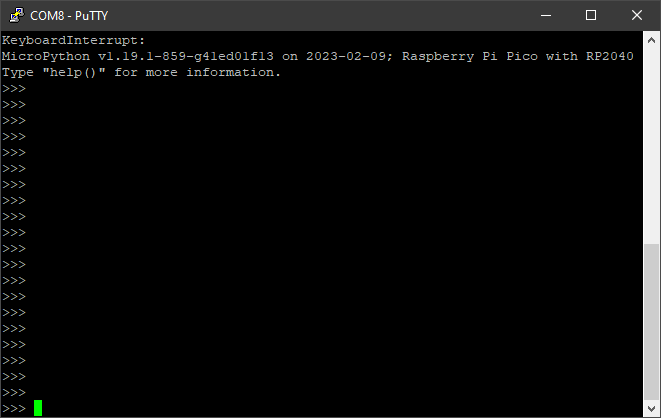

Ready to talk!

## On Linux

1.  You probably know yourself

# Set up badge firmware on a plain Raspberry Pi Pico

Set up PICO for badge

1.  Set up micropython firmware

    - Boot RPI into bootloader mode (hold BOOTSEL button and plug in
      USB)
    - Copy micropython `uf2` file to storage device (download yourself
      or located in `firmware/upython/rp2-firmware/rp2-pico-latest.uf2`)

2.  Copy firmware folder to device, for example with
    [`mpytool`](https://github.com/pavelrevak/mpytool)

    - `mpytool -p SERIALPORT put firmware/upython/badge/`

To do stuff over serial, connect with `SERIALPORT`, baudrate 115200.

# Misc

To build this document in to various formats:

    quarto render README.qmd --to pdf && \
    quarto render README.qmd --to html && \
    quarto render README.qmd --to docx && \
    quarto render README.qmd --to gfm
